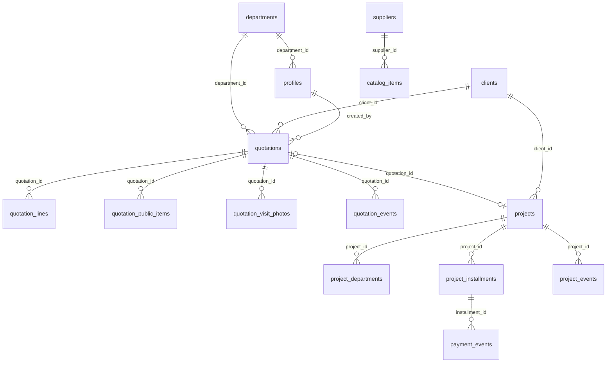

# Supabase — blueprint Technik Dashboard

Este directorio es el **diseño listo para aplicar** cuando el prototipo visual/flujos estén cerrados.  
La app **sigue en mock** (`TechnikProvider` + `localStorage`); aún no hay cliente Supabase ni variables de entorno.

## Decisiones de producto (v1)

| Decisión | Valor v1 | Nota |
|----------|----------|------|
| Canal del cliente | Registro interno por staff | Sin portal/link de aprobación. `client_response` lo marca admin/empleado autorizado. |
| Cobros inmutables | Sí, una vez `paid_at` | No borrar ni desmarcar abonos cobrados. Corrección = `payment_events` (nota). |
| Outbound email/WhatsApp | Mock en v1 | Edge Functions / Resend después. |
| Multi-tenant | Single company | Sin `org_id`. |
| Post-envío PDF | Inmutable comercialmente | No editar `lines` / `public_items` / tax-terms. Cambios → **duplicar** cotización (nuevo folio). |
| Rechazo con proyecto | Bloqueado | No marcar `rechazada` si ya existe proyecto; cerrar/cancelar proyecto aparte. |
| Archivo | `status = closed` | UI Archivar + filtro Archivadas. |

### Precios / economía interna (contrato UI)

Constantes en [`lib/technik/company.ts`](../lib/technik/company.ts):

| Constante | Valor | Uso |
|-----------|-------|-----|
| `MATERIAL_PUBLIC_MARKUP` | 0.10 | Precio público sugerido = costo × 1.10 (editable hasta envío) |
| `LABOR_BURDEN_RATE` | 0.20 | IMSS/INFONAVIT solo en economía interna |
| `INTERNAL_PROFIT_RATE` | 0.60 | Ganancia = (MO base + mat. + extras) × 60% |
| `ANNUAL_BONUS_RATE` | 0.10 | Bono anual = (ganancia + mat. + extras) × 10% |
| `DEFAULT_LABOR_HOURLY_RATE` | 110 | Tarifa $/h default en catálogo (`unit_cost` labor) |

- Catálogo `kind`: `material` \| `labor` \| `extra` (códigos `TKS-E-###` para extras).
- PDF / `public_items`: solo concepto + totales (sin fórmula ni %).
- Cálculo mock: `suggestedPublicUnitPrice`, `internalEconomy` en [`lib/technik/data.ts`](../lib/technik/data.ts).
- Eventos de cobro mock: `paymentEvents` en workspace (`PaymentEvent`).

## Qué hay aquí

| Archivo | Contenido |
|---------|-----------|
| [`migrations/20260810180000_enums_and_core.sql`](migrations/20260810180000_enums_and_core.sql) | Enums, tablas, índices, folios RPC, triggers `updated_at` |
| [`migrations/20260810180100_rls.sql`](migrations/20260810180100_rls.sql) | Helpers de rol + políticas RLS |
| [`migrations/20260810180200_storage.sql`](migrations/20260810180200_storage.sql) | Buckets `avatars` y `quote-images` |
| [`migrations/20260813120000_visit_photos.sql`](migrations/20260813120000_visit_photos.sql) | Tabla `quotation_visit_photos` + bucket `visit-photos` (JPEG/WebP ≤ 220 KB) |
| [`MIGRATION_CHECKLIST.md`](MIGRATION_CHECKLIST.md) | Orden para cablear la app sin lift-and-shift |

## ERD (resumen)

Notas de cobro / folios:
- Folio público del proyecto = `projects.id` = folio de cotización (`TKS-Q-…`) cuando nace de una aprobada.
- Serie `TKS-P-…` (`next_code('project')`) solo para proyectos sin cotización (N/A).
- No hay folio interno de factura; cada cuota lleva `invoice_uuid` (CFDI), `invoice_date` y `payment_complement`.
- `payment_mode` = método CFDI; `method` en la cuota = medio de cobro.

## Cuándo conectar

Aplicar migraciones y sustituir el store **solo cuando**:

1. State machine cotización + cobro esté estable en el prototipo.
2. Matriz RLS de abajo coincida con la UI real.
3. Se haya probado el SQL en un proyecto Supabase de staging.

**No** reutilizar el sync de snapshot `localStorage`/BroadcastChannel como modelo de Realtime: usar cambios por fila.
